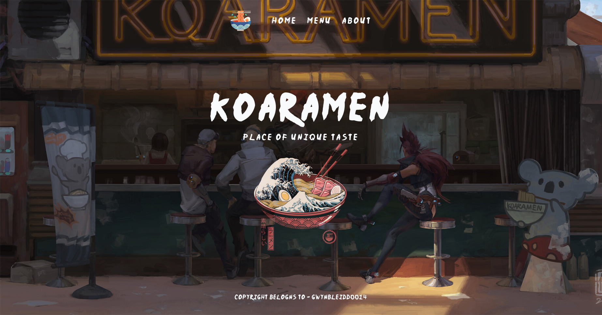

# Odin Project - Restaurant Page

This is a solution to Odin Projects Restaurant Page challange.

## Table of contents

- [Overview](#overview)
  - [Screenshot](#screenshot)
  - [Links](#links)
- [Author](#author)

## Overview

This is a single page app, built with vanilla js, I practiced es modules, and got familiar with webpack.

### Screenshot

### Links

[Click to view live site](https://gwynbleidd0014.github.io/restaurant-page/)

## Author

Hello, I'm Ucha, you might know me as [gwynbleidd0014](https://github.com/gwynbleidd0014) on github
